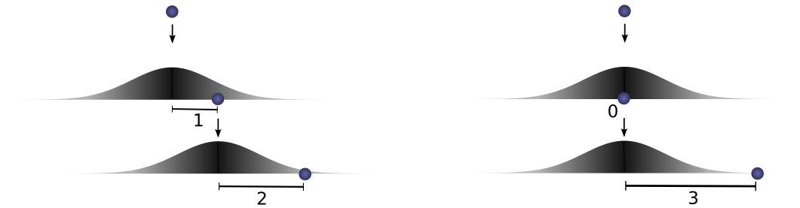
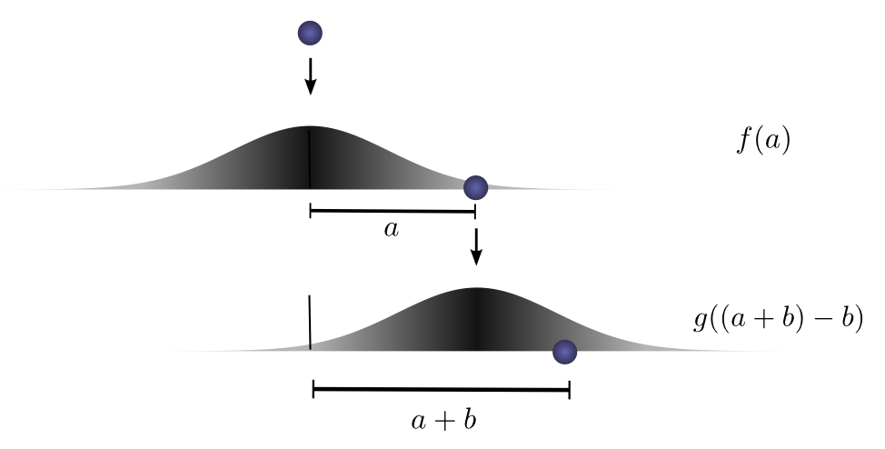

Convolutions
------------

Imagine we drop a ball from some height onto the ground, where it only has one dimension of motion. *How likely is it that a ball will go a distance $c$ if you drop it and then drop it again from above the point at which it landed?*

Let's break this down. After the first drop, it will land $a$ units away from the starting point with probability $f(a)$, where $f$ is the probability distribution.

Now after this first drop, we pick the ball up and drop it from another height above the point where it first landed. The probability of the ball rolling $b$ units away from the new starting point is $g(b)$, where $g$ may be a different probability distribution if it's dropped from a different height.

If we fix the result of the first drop so we know the ball went distance $a$, for the ball to go a total distance $c$, the distance travelled in the second drop is also fixed at $b$, where $a+b=c$. So the probability of this happening is simply $f(a) \cdot g(b)$.[^expl]

[^expl]: 
    We want the probability of the ball rolling $a$ units the first time and also rolling $b$ units the second time. There are two ways of getting to this, the way that is more mathematically intuitive, and the way that more closely adheres to the visuals of the problem. 

    We can consider $f$ and $g$ to be independent, with both distributions centered at 0 and then the distances $a$ and $b$ are added. So $P(a,b) = P(a) * P(b) = f(a) \cdot g(b)$. 

    Alternatively, we can think of the probability distribution $g$ as shifted over and centered at $a$, to better visually match the problem. In this view, $P(a,b) = P(a) \cdot P(a+b \vert a)$, because the shifted version is conditional on $a$ and we now want to find the total distance. This evaluates to $f(a) \cdot g(a+b-a)=f(a) \cdot g(b)$.

    So it doesn't matter whether we think about the indepedent probability distribution $g(x)$ or the conditional distribution $g(x-a)$ because both perspectives end up evaluating to the same thing.

Let's think about this with a specific discrete example. We want the total distance $c$ to be 3. If the first time it rolls, $a=2$, the second time it must roll $b=1$ in order to reach our total distance $a+b=3$. The probability of this is $f(2) \cdot g(1)$. 

However, this isn't the only way we could get to a total distance of 3. The ball could roll 1 units the first time, and 2 the second. Or 0 units the first time and all 3 the second. It could go any $a$ and $b$, as long as they add to 3.

In order to find the *total likelihood* of the ball reaching a total distance of $c$, we can't consider only one possible way of reaching $c$. Instead, we consider *all the possible ways* of partitioning $c$ into two drops $a$ and $b$ and sum over the *probability of each way*. 

We already know that the probability for each case of $a+b=c$ is simply $f(a) \cdot g(b)$. So, summing over every $a+b=c$, we can denote the total likelihood as:
$$\sum_{a+b=c} f(a) \cdot g(b) = ... + f(-1)\cdot g(4) + f(0)\cdot g(3) + f(1)\cdot g(2) + f(2)\cdot g(1) + ...$$
Turns out, we're doing a convolution! 

--------

--------

--------

--------

--------

$$y_n = \sigma\left(W\left[\begin{array}{c}x_{n}\\ x_{n+1}\\...\\\end{array}\right] + b\right)$$

