

<link rel="stylesheet" href="https://ajax.googleapis.com/ajax/libs/jqueryui/1.10.3/themes/smoothness/jquery-ui.min.css">

<!--  -->
<!--   -->

At some fundamental level, no one understands machine learning.

It isn’t a matter of things being too complicated.
Almost everything we do is fundamentally very simple.
Unfortunately, an innate human handicap interferes with us understanding these simple things.

Humans evolved to reason fluidly about two and three dimensions. With some effort, we may think in four dimensions.
Machine learning often demands we work with thousands  of dimensions -- or tens of thousands, or millions!
Even very simple things become hard to understand when you do them in very high numbers of dimensions.

Reasoning directly about these high dimensional spaces is just short of hopeless.

As is often the case when humans can’t directly do something, we’ve built tools to help us.
There is an entire, well-developed field, called dimensionality reduction, which explores techniques for translating high-dimensional data into lower dimensional data.
Much work has also been done on the closely related subject of visualizing high dimensional data.

These techniques are the basic building blocks we will need if we wish to visualize machine learning, and deep learning specifically.
My hope is that, through visualization and observing more directly what is actually happening, we can understand neural networks in a much deeper and more direct way.

And so, the first thing on our agenda is to familiarize ourselves with dimensionality reduction.
To do that, we're going to need a dataset to test these techniques on.

MNIST
======

MNIST is a simple computer vision dataset.
It consists of 28x28 pixel images of handwritten digits, such as:

 

 

 

Every MNIST data point, every image, can be thought of as an array of numbers describing how dark each pixel is.
For example, we might think of $\mnist[1]{1}$ as something like:

 

 

Since each image has 28 by 28 pixels, we get a 28x28 array.
We can flatten each array into a $28*28 = 784$ dimensional vector.
Each component of the vector is a value between zero and one describing the intensity of the pixel.
Thus, we generally think of MNIST as being a collection of 784-dimensional vectors.

Not all vectors in this 784-dimensional space are MNIST digits.
Typical points in this space are very different!
To get a sense of what a typical point looks like, we can randomly pick a few points and examine them.
In a random point -- a random 28x28 image -- each pixel is randomly black, white or some shade of gray.
The result is that random points look like noise.

 

 

 

Images like MNIST digits are very rare.
While the MNIST data points are *embedded* in 784-dimensional space, they live in a very small subspace.
With some slightly harder arguments, we can see that they occupy a lower dimensional subspace.

People have lots of theories about what sort of lower dimensional structure MNIST, and similar data, have.
One popular theory among machine learning researchers is the *manifold hypothesis*: MNIST is a low dimensional manifold, sweeping and curving through its high-dimensional embedding space.
Another hypothesis, more associated with topological data analysis, is that data like MNIST consists of blobs with tentacle-like protrusions sticking out into the surrounding space.

But no one really knows, so let's explore!

The MNIST Cube
===============

We can think of the MNIST data points as points suspended in a 784-dimensional cube.
Each dimension of the cube corresponds to a particular pixel.
The data points range from zero to one according to the pixels intensity.
On one side of the dimension, there are images where that pixel is white.
On the other side of the dimension, there are images where it is black.
In between, there are images where it is gray.

 

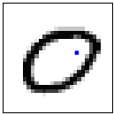
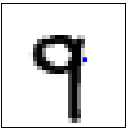
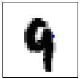
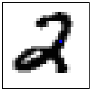
 

 

If we think of it this way, a natural question occurs.
What does the cube look like if we look at a particular two-dimensional face?
Like staring into a snow-globe, we see the data points projected into two dimensions, with one dimension corresponding to the intensity of a particular pixel, and the other corresponding to the intensity of a second pixel.
Examining this allows us to explore MNIST in a very raw way.

 
*In this visualization, each dot is an MNIST data point. The dots are colored based on which class of digit the data point belongs to. When your mouse hovers over a dot, the image for that data point is displayed on each axis. Each axis corresponds to the intensity of a particular pixel, as labeled and visualized as a blue dot in the small image beside it. By clicking on the image, you can change which pixel is displayed on that axis.*

 

Exploring this visualization, we can see some glimpses of the structure of MNIST.
Looking at the <a href="#raw_mnist" onclick="raw_mnist_show([7,13], [18,16])">pixels $p_{18,16}$ and $p_{7,12}$</a>, we are able to separate a lot of zeros to the bottom right and a lot of nines to the top left.
Looking at <a href="#raw_mnist" onclick="raw_mnist_show([5,7], [7,10])">pixels $p_{5,6}$ and $p_{7,9}$</a> we can see a lot of twos at the top right and threes at the bottom right.

Despite minor successes like these, one can't really can't understand MNIST this way.
The small insights one gains feel very fragile and feel a lot like luck.
The truth is, simply, that very little of MNIST's structure is visible from these perspectives.
You can't understand images by looking at just two pixels at a time.

But there's lots of other perspectives we could look at MNIST from!
In these perspectives, instead of looking a face straight on, one looks at it from an angle.

The challenge is that we need to choose what perspective we want to use.
What angle do we want to look at it from horizontally?
What angle do we want to look at it from vertically?
Thankfully, there's a technique called [Principal Components Analysis] (PCA) that will find the best possible angle for us.
By this, we mean that PCA will find the angle that spreads out the points the most (captures the most variance possible).

[Principal Components Analysis]: http://en.wikipedia.org/wiki/Principal_component_analysis

But, what does it even mean to look at a 784-dimensional cube from an angle? Well, we need to decide which direction every axis of the cube should be tilted: to one side, to the other, or somewhere in between?

To be concrete, the following are pictures of the two angles PCA chooses. Red represents tilting a pixel's dimension to one side, blue to the other.

 

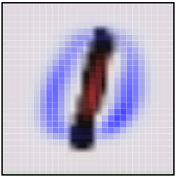
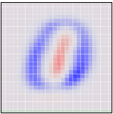
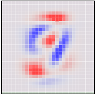

 

If an MNIST digit primarily highlights red, it ends up on one side. If it highlights blue, it ends up on a different side. The first angle -- the "first principal component" -- will be our horizontal angle, pushing ones (which highlight lots of red and little blue) to the left and zeros (which highlight lots or blue and little red) to the right.

 

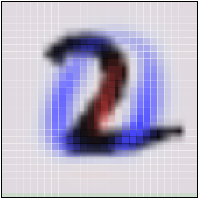
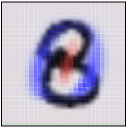
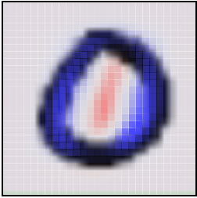
 

 

<!--  

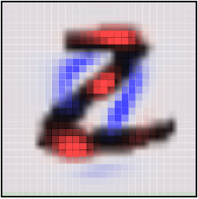
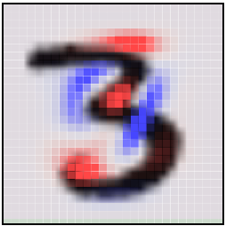
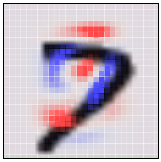
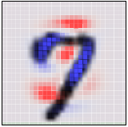

  -->

Now that we know what the best horizontal and vertical angle are, we can try to look at the cube from that perspective.

 

*This visualization is much like the one above, but now the axes are fixed to displaying the first and second 'principal components,' basically angles of looking at the data. In the image on each axis, blue and red are used to denote what the 'tilt' is for that pixel. Pixel intensity in blue regions pushes a data point to one side, pixel intensity in red regions pushes us to the other.*

 

**Visualizing MNIST with PCA**

 

While much better than before, it's still not terribly good.
Unfortunately, even looking at the data from the best angle, MNIST data doesn't line up nicely for us to look at.
It's a non-trivial high-dimensional structure, and these sorts of linear projections just aren't going to cut it.

Thankfully, we have some powerful tools for dealing with datasets which are... uncooperative.

Optimization-Based Dimensionality Reduction
===========================================

What would we consider a success?
What would it mean to have the 'perfect' visualization of MNIST?
What should our goal be?

One really nice property would be if the distances between points in our visualization were the same as the distances between points in the original space.
If that was true, we'd be capturing the global geometry of the data.

Let's be a bit more precise. For any two MNIST data points, $x_i$ and $x_j$, there are two notions of distance between them.
One is the distance between them in the original space[^DistanceType] and one is the distance between them in our visualization.
We will use $d^*_{i,j}$ to denote the distance between $x_i$ and $x_j$ in the original space and $d_{i,j}$ to denote the distance between $x_i$ and $x_j$ in our visualization.
Now we can define a *cost*:

[^DistanceType]: We have a number of options for defining distance between these high-dimensional vectors. For this post, we will use L2 distance, $d(x_i,x_j) = \sqrt{\sum_n (x_{i,n}-x_{j,n})^2}$ &nbsp;

$$C = \sum_{i\neq j} ~(d^{*}_{i,j} - d_{i,j})^2$$

This value describes how *bad* a visualization is.
It basically says: "It's bad for distances to not be the same. In fact, it's quadratically bad."
If it's high, it means that distances are dissimilar to the original space.
If it's small, it means they are similar.
If it is zero, we have a 'perfect' embedding.

That sounds like an optimization problem!
And deep learning researchers know what to do with those!
We pick a random starting point and apply [gradient descent]. [^OptimizationDetails]

[^OptimizationDetails]: We initialize the points' positions by sampling a Gaussian around the origin. Our optimization process isn't standard gradient descent. Instead, we use a variant of momentum gradient descent. Before adding the gradient to the momentum, we normalize the gradient. This reduces the need for hyper-parameter tuning. &nbsp;

[gradient descent]: http://en.wikipedia.org/wiki/Gradient_descent

 

 

**Visualizing MNIST with MDS**

 

This technique is called [multidimensional scaling] (or MDS).
If you like, there's a more physical description of what's going on.
First, we randomly position each point on a plane.
Next we connect each pair of points with a spring with the length of the original distance, $d^{*}_{i,j}$.
Then we let the points move freely and allow physics to take its course!

[multidimensional scaling]: http://en.wikipedia.org/wiki/Multidimensional_scaling

We don't reach a cost of zero, of course.
Generally, high-dimensional structures can't be embedded in two dimensions in a way that preserves distances perfectly.
We're demanding the impossible!
But, even though we don't get a perfect answer, we do improve a lot on the original random embedding, and come to a decent visualization.
We can see the different classes begin to separate, especially the ones.

Sammon's Mapping
-----------------

Still, it seems like we should be able to do much better.
Perhaps we should consider different cost functions?
There's a huge space of possibilities.
To start, there's a lot of variations on MDS.
A common theme is cost functions emphasizing *local* structure as more important to maintain than global structure.
A very simple example of this is [Sammon's Mapping], defined by the cost function:

[Sammon's Mapping]: http://en.wikipedia.org/wiki/Sammon_mapping

$$C = \sum_{i\neq j} \frac{(d^{*}_{i,j} - d_{i,j})^2}{d^{*}_{i,j}}$$

In Sammon's mapping, we try harder to preserve the distances between nearby points than between those which are far apart.
If two points are twice as close in the original space as two others, it is twice as important to maintain the distance between them.

 

 

**Visualizing MNIST with Sammon's Mapping**

 

For MNIST, the result isn't that different.
The reason has to do with a rather unintuitive property regarding distances in high-dimensional data like MNIST.
Let's consider the distances between some MNIST digits.
For example, the distance between the similar ones, $\mnist{6}$ and $\mnist{8}$, is $$d(\mnist{6}, \mnist{8}) = 4.53$$
On the other hand, the difference between the very different data points, $\mnist{4}$ and $\mnist{12}$, is $$d(\mnist{4}, \mnist{12}) = 12.0$$ less than three times $d(\mnist{6}, \mnist{8})$!

Because there's so many ways similar points can be slightly different, the average distance between similar points is quite high.
Conversely, as you get further away from a point, the amount of volume within that distance increases to an extremely high power, and so you are likely to run into different kinds of points.
The result is that, in pixel space, the difference in distances between 'similar' and 'different' points can be much less than we'd like, even in good cases.

Graph Based Visualization
-------------------------

Perhaps, if local behavior is what we want our embedding to preserve, we should optimize for that more explicitly.

Consider a [nearest neighbor graph] of MNIST.
For example, consider a graph $(V,E)$ where the nodes are MNIST data points, and each point is connected to the three points that are closest to it in the original space.[^knn-graph-max-neighbors]
This graph is a simple way to encode local structure and forget about everything else.

Given such a graph, we can use standard graph layout algorithms to visualize MNIST.
Here, we will use [force-directed graph drawing]: we pretend that all points are repelling charged particles, and that the edges are springs.
This gives us a cost function:

[^knn-graph-max-neighbors]: Note that points can end up connected to more, if they are the nearest neighbor of many points. &nbsp;

[nearest neighbor graph]: http://en.wikipedia.org/wiki/Nearest_neighbor_graph
[force-directed graph drawing]: http://en.wikipedia.org/wiki/Force-directed_graph_drawing

$$C~ = ~\sum_{i\neq j}\frac{1}{d_{i,j}} ~+~ \frac{1}{2}\sum_{(i,j) \in E} (d_{i,j} - d^{*}_{i,j})^2$$

Which we minimize.

 

 

**Visualizing MNIST as a Graph**

 

The graph discovers a lot of structure in MNIST.
In particular, it seems to find the different MNIST classes.
While they overlap, during the graph layout optimization we can see the clusters sliding over each other.
They are unable to avoid overlapping when embedded on the plane due to connections between classes, but the cost function is at least *trying* to separate them.

One nice property of the graph visualization is that it explicitly shows us which points are connected to which other points.
In earlier visualizations, if we see a point in a strange place, we are uncertain as to whether it's just stuck there, or if it should actually be there.
The graph structure avoids this.
For example, if you look at the red cluster of zeros, you will see a single blue point, the six $\mnist{494}$, among them.
You can see from its neighbors that it is supposed to be there, and from looking at it you can see that it is, in fact, a very poorly written six that looks more like a zero.

 

t-Distributed Stochastic Neighbor Embedding
-------------------------------------------

The final technique I wish to introduce is the [t-Distributed Stochastic Neighbor Embedding] (t-SNE).
This technique is extremely popular in the deep learning community.
Unfortunately, t-SNE's cost function involves some non-trivial mathematical machinery and requires some significant effort to understand.

But, roughly, what t-SNE tries to optimize for is preserving the *topology* of the data.
For every point, it constructs a notion of which other points are it's 'neighbors,' trying to make all points have the same number of neighbors.
Then it tries to embed them so that those points all have the same number of neighbors.

In some ways, t-SNE is a lot like the graph based visualization.
But instead of just having points be neighbors (if there's an edge) or not neighbors (if there isn't an edge), t-SNE has a continuous spectrum of having points be neighbors to different extents.

t-SNE is often very successful at revealing clusters and subclusters in data.

 

 

**Visualizing MNIST with t-SNE**

 

t-SNE does an impressive job finding clusters and subclusters in the data, but is prone to getting stuck in local minima.
For example, in the following image we can see two clusters of zeros (red) that fail to come together because a cluster of sixes (blue) get stuck between them.

 

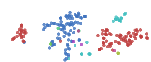

 

A number of tricks can help us avoid these bad local minima.
Firstly, using more data helps a lot.
Because these visualizations are embeded in a blog post, they only use 1,000 points.
Using the full 50,000 MNIST points works a lot better.
In addition, it is recommended that one use [simulated annealing] and carefully select a number of hyperparamters.

Well done t-SNE plots reveal many interesting features of MNIST.

 

 

**A t-SNE plot of MNIST**

 

An even nicer plot can be found on the page labeled 2590, in the original t-SNE paper, [Maaten & Hinton (2008)].

It's not just the classes that t-SNE finds. Let's look more closely at the ones.

 

 

**A t-SNE plot of MNIST ones**

 

The ones cluster is stretched horizontally. As we look at digits from left to right, we see a consistent pattern.

$$\mnist[1]{7} \to \mnist[1]{4} \to \mnist[1]{8} \to \mnist[1]{6} \to \mnist[1]{2} \to \mnist[1]{1}$$

They move from forward leaning ones, like $\mnist[1]{4}$, into straighter like $\mnist[1]{6}$, and finally to slightly backwards leaning ones, like $\mnist[1]{1}$.
It seems that in MNIST, the primary factor of variation in the ones is tilting.
This is likely because MNIST normalizes digits in a number of ways, centering and scaling them.
After that, the easiest way to be "far apart" is to rotate and not overlap very much.

Similar structure can be observed in other classes, if you look at the [t-SNE plot](#tsne_mnist_nice) again.

[t-Distributed Stochastic Neighbor Embedding]: http://jmlr.csail.mit.edu/papers/volume9/vandermaaten08a/vandermaaten08a.pdf
[simulated annealing]: http://en.wikipedia.org/wiki/Simulated_annealing
[Maaten & Hinton (2008)]: http://jmlr.org/papers/volume9/vandermaaten08a/vandermaaten08a.pdf

Visualization in Three Dimensions
=================================

Watching these visualizations, there's sometimes this sense that they're begging for another dimension.
For example, watching the graph visualization optimize, one can see clusters slide over top of each other.

Really, we're trying to compress this extremely high-dimensional structure into two dimensions.
It seems natural to think that there would be very big wins from adding an additional dimension.
If nothing else, at least in three dimensions a line connecting two clusters doesn't divide the plane, precluding other connections between clusters.

In the following visualization, we construct a nearest neighbor graph of MNIST, as before, and optimize the same cost function.
The only difference is that there are now three dimensions to lay it out in.

 

**Visualizing MNIST as a Graph in 3D**   (click and drag to rotate)

 

The three dimensional version, unsurprisingly, works much better.
The clusters are quite separated and, while entangled, no longer overlap.

In this visualization, we can begin to see why it is easy to achieve around 95% accuracy classifying MNIST digits, but quickly becomes harder after that.
You can make a lot of ground classifying digits by chopping off the colored protrusions above, the clusters of each class sticking out.
(This is more or less what a linear Support Vector Machine does.[^SVM_hedge])
But there's some much harder entangled sections, especially in the middle, that are difficult to classify.

[^SVM_hedge]: This isn't quite true. A linear SVM operates on the original space. This is a non-linear transformation of the original space. That said, this strongly suggests something similar in the original space, and so we'd expect something similar to be true. &nbsp;

Of course, we could do any of the above techniques in 3D! Even something as simple as MDS is able to display quite a bit in 3D.

 

**Visualizing MNIST with MDS in 3D**   (click and drag to rotate)

 

In three dimensions, MDS does a much better job separating the classes than it did with two dimensions.

And, of course, we can do t-SNE in three dimensions.

 

**Visualizing MNIST with t-SNE in 3D**   (click and drag to rotate)

 

Because t-SNE puts so much space between clusters, it benefits a lot less from the transition to three dimensions.
It's still quite nice, though, and becomes much more so with more points.

If you want to visualize high dimensional data, there are, indeed, significant gains to doing it in three dimensions over two.

Conclusion
============

Dimensionality reduction is a well developed area, and we're only scratching the surface here.
There are hundreds of techniques and variants that are unmentioned here.
I'd encourage you to explore!

It's easy to slip into a mind set of thinking one of these techniques is better than the others.
But I think they're really complementary.
There's no way to map high-dimensional data into low dimensions and preserve all the structure.
So, an approach must make trade offs, sacrificing one property to preserve another.
PCA tries to preserve linear structure, MDS tries to preserve global geometry, and t-SNE tries to preserve topology (neighborhood structure).

These techniques give us a way to gain traction on understanding high-dimensional data.
While directly trying to understand high-dimensional data with the human mind is all but hopeless, with these tools we can begin to make progress.

In the next post, we will explore applying these techniques to some different kinds of data -- in particular, to visualizing representations of text.
Then, equipped with these techniques, we will shift our focus to understanding neural networks themselves, visualizing how they transform high-dimensional data and building techniques to visualize the space of neural networks.
If you're interested, you can subscribe to my [rss feed](../../rss.xml) so that you'll see these posts when they are published.

*(I would be delighted to hear your comments and thoughts: you can comment inline or at the end. For typos, technical errors, or clarifications you would like to see added, you are encouraged to make a pull request on [github](https://github.com/colah/Visualizing-Deep-Learning/))*

Acknowledgements
=================

I'm grateful for the hospitality of Google's deep learning research group, which had me as an intern while I wrote this post and did the work it is based on.
I'm especially grateful to my internship host, Jeff Dean.

I was greatly helped by the comments, advice, and encouragement of many Googlers, both in the deep learning group and outside of it. These include: 
Greg Corrado, Jon Shlens, Matthieu Devin,
Andrew Dai, Quoc Le,
Anelia Angelova,
Oriol Vinyals, Ilya Sutskever, Ian Goodfellow,
Jutta Degener, and Anna Goldie.

I was strongly influenced by the thoughts, comments and notes of Michael Nielsen, especially his notes on Bret Victor's work.
Michael's thoughts persuaded me that I should think seriously about interactive visualizations for understanding deep learning.

I was also helped by the support of a number of non-Googler friends, including Yoshua Bengio, Dario Amodei, Eliana Lorch, Taren Stinebrickner-Kauffman, and Laura Ball.

This blog post was made possible by a number of wonderful Javascript libraries, including [D3.js](http://d3js.org/), [MathJax](http://www.mathjax.org/), [jQuery](http://jquery.com/), and [three.js](http://threejs.org/). A big thank you to everyone who contributed to these libraries.

